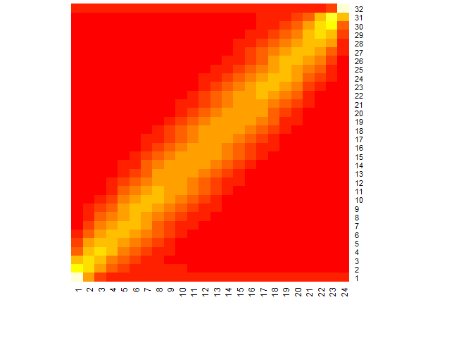

Grid D Stats
================

Code Initialization
-------------------

This is an R Markdown format used for publishing markdown documents to GitHub. When you click the **Knit** button all R code chunks are run and a markdown file (.md) suitable for publishing to GitHub is generated.

``` r
m <- 23L
n <- 31L

ntrials <- 100L * 1000000L
```

Rcpp Acceleration
-----------------

You can include C++ code in the document as follows:

``` cpp
#include <Rcpp.h>
using namespace Rcpp;

// wrapper around R's RNG such that we get a uniform distribution over
// [0,n) as required by the STL algorithm

inline int randWrapper(const int n) { return floor(unif_rand()*n); }

// [[Rcpp::export]]
NumericMatrix rngCpp(const int M, const int N, const int trials) {
  NumericMatrix Visits(N + 1,M + 1);
  NumericVector moves(M + N); //= runif(M + N - 1);
  NumericVector initm(M + N);
  
  for(int i = 0; i < M; i++) initm[i] = 1;
  for(int i = M; i < M + N; i++) initm[i] = 0;
  
  int x = 0, y = 0;
  int dx = 0, dy = 0;
  
  for(int trl = 0; trl < trials; trl++) {
    x = 0; y = 0;
    moves = Rcpp::clone(initm);
    std::random_shuffle(moves.begin(), moves.end(), randWrapper);
    Visits(0,0)++;
    for(int i = 0; i < moves.size(); i++) {
        if (moves[i] > 0.5) {
            dx = 1;
            dy = 0;
        } else {
            dx = 0;
            dy = 1;
        }
        if (dx > 0 && x < M) x = x + 1;
        if (dy > 0 && y < N) y = y + 1;
        if (dx > 0 && x == M) y = (y < N) ? y + 1 : y;
        if (dy > 0 && y == N) x = (x < M) ? x + 1 : x;
        Visits(y, x)++;
    }
  }
  
  if (x != M || y != N) Visits(0,0) = -1;
  return Visits;
}
```

Invoke the C++ function from R:

``` r
z <- rngCpp(m,n, ntrials)
```

Include Plots
-------------

You can also embed plots, for example:

``` r
heatmap(z, Rowv = NA, Colv = NA)
```


